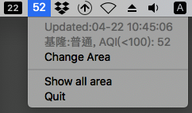

# AQI-app

processing

<!-- **It's a simple app.** -->

<!-- It works on MacOS **v10.13, v11.2**. -->

<!-- MacOS app for monitor Taiwan air quality. -->

<!--  -->

<!-- ## Requirement -->
<!--   * Python == 3.9 -->
<!--   * [rumps](https://github.com/jaredks/rumps) >= 0.3.0 -->

<!-- ## Run app -->
<!-- ```bash -->
<!-- $ python AQI.py -->
<!-- ``` -->

<!-- Recommended use [pyinstaller](https://pyinstaller.readthedocs.io/en/stable/feature-notes.html#macos-binary-code-signing) pack app -->
<!-- ```bash -->
<!-- pyinstaller --onedir --windowed AQI.py -->
<!-- ``` -->


