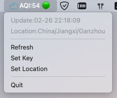

# AQI-app

It works on MacOS **v10.13, v12.1**.

MacOS app for monitor world air quality.




## Requirement
  * Python == 3.9
  * [rumps](https://github.com/jaredks/rumps) >= 0.3.0
  * [pygame_gui](https://github.com/MyreMylar/pygame_gui) >= 0.6.4
  * [pyinstaller](https://github.com/pyinstaller/pyinstaller) >= 4.8

## Run app
```bash
./build_app.sh && open dist/AQI.app
```

